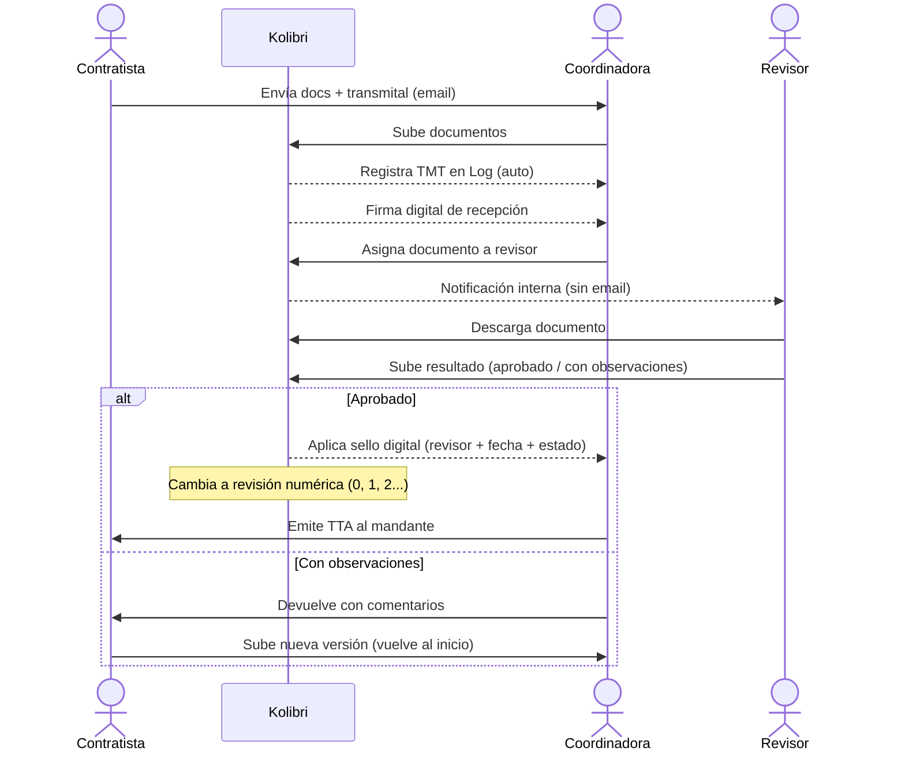

# SPEC — Kolibri

> **Versión:** 0.1 — Borrador inicial basado en reunión con cliente  
> **Fecha:** Mayo 2026  
> **Socios:** Nathalie · Álvaro · Ignacio  
> **Piloto:** Empresa actual de Nathalie (minería, 2da Región de Chile)

---

## 1. Problema

Las pequeñas y medianas empresas mineras (contratistas) gestionan su control documental con **correo electrónico + Excel + SharePoint manual**. Esto genera:

- **Sobrecarga operativa**: la encargada recibe hasta 100 correos diarios, trabajando 12 horas.
- **Demoras**: 2–3 días para que un revisor vea un documento entre el volumen de correos.
- **Pérdida de trazabilidad**: sin sistema centralizado, se pierde el historial de revisiones.
- **Trabajo duplicado**: los documentos se registran en SharePoint local y en el SharePoint global del mandante (ej. Capstone), por separado.

---

## 2. Solución propuesta

Plataforma web SaaS de **gestión y trazabilidad del ciclo de vida documental**, orientada a empresas contratistas mineras. Reemplaza el flujo de correo + Excel con un flujo centralizado de carga, asignación, revisión y aprobación de documentos.

### 2.1 Propuesta de valor

- Cero dependencia del correo para gestionar revisiones internas.
- Trazabilidad automática del ciclo completo: recepción → revisión → subsanación → aprobación.
- Cada revisor ve solo sus documentos pendientes.
- Registro automático equivalente al Log de Control Documental en Excel.

---

## 3. Modelo de negocio

| Atributo | Detalle |
|---|---|
| Tipo | SaaS B2B, suscripción mensual |
| Target | Empresas contratistas mineras familiares/medianas |
| Geografía inicial | 2da Región de Chile |
| Go-to-market | Piloto interno → referidos → venta a contratistas similares |
| Sociedad | Igualitaria entre 3 fundadores |

---

## 4. Usuarios y roles

| Rol | Descripción |
|---|---|
| **Administrador / Coordinadora Documental** | Carga documentos, crea transmitales, asigna revisores, actualiza el log, cierra ciclos. Equivalente al rol actual de Nathalie. |
| **Revisor** | Recibe documentos asignados, descarga, sube versión comentada o aprueba. Solo ve sus pendientes. |
| **Gerente / Supervisor** | Vista de estado general por proyecto/contrato. Sin edición. |
| *(Evaluando)* **Contratista externo** | Acceso directo en evaluación. Por ahora la coordinadora recibe documentos por correo y los sube manualmente en el módulo de recepción. |

---

## 5. Flujo principal — Control Documental

El flujo sigue el proceso real documentado por Nathalie:

```
[Contratista externo]
        │
        ▼ Envía entregables + Transmital (TMT-xxx)
[1. RECEPCIÓN]
  - Coordinadora registra el transmital
  - Firma de recepción (digital)
  - El sistema registra fecha de ingreso y plazo de respuesta
        │
        ▼
[2. CARGA DE DOCUMENTOS]
  - Sube archivos al sistema
  - Asigna a proyecto/contrato y tipo (plano, informe, hoja de datos)
  - Sistema auto-genera código de documento y entrada en el Log
        │
        ▼
[3. ASIGNACIÓN A REVISOR]
  - Coordinadora asigna documento(s) a revisor interno
  - Revisor recibe notificación en la plataforma (no por correo)
        │
        ▼
[4. REVISIÓN]
  - Revisor descarga, revisa, y sube documento con comentarios O aprueba
  - Resultado: Aprobado / Con observaciones / Rechazado
        │
        ▼
[5. SUBSANACIÓN (si aplica)]
  - Coordinadora devuelve al contratista con observaciones
  - Contratista sube nueva revisión
  - Ciclo se repite hasta aprobación
        │
        ▼
[6. APROBACIÓN FINAL]
  - Documento sube de revisión letra (B, C, D...) a revisión numérica (0, 1, 2...)
  - Sistema aplica timbre/sello digital con: revisor, fecha, estado
  - Coordinadora emite TTA (transmital de transferencia al mandante)
  - Registro final en el Log de Control
```

### 5.1 Sistema de revisiones

| Tipo de revisión | Significado |
|---|---|
| **Letra (B, C, D...)** | Revisión interna. B = primera recepción. |
| **Numérica (0, 1, 2...)** | Documento aprobado, apto para construcción. |

El sistema debe gestionar ambos tipos y reflejar el estado actual de cada documento de forma visual.

---

## 6. Módulos del sistema

### 6.1 Módulo Core — Control Documental *(MVP)*

- **Bandeja de entrada / Dashboard**
  - Vista por proyecto/contrato
  - Documentos pendientes por rol
  - Alertas de vencimiento de plazo

- **Gestión de Transmitales**
  - Crear y registrar transmitales de entrada (TMT)
  - Firma digital de recepción
  - Adjuntar documentos al transmital

- **Log de Control Documental** *(equivalente digital del Excel)*
  - Registro automático al cargar documento
  - Campos: código, título, tipo, revisión, fecha recepción, revisor asignado, plazo, estado
  - Búsqueda por código para actualizar cuando cambia de revisión

- **Gestión de Documentos**
  - Carga de archivos (PDF, DWG, XLSX, etc.)
  - Versionado automático por revisión
  - Vista del historial completo de un documento
  - Timbre/sello digital configurable por empresa

- **Flujo de Revisión**
  - Asignación de revisor por documento o lote
  - Estados: Pendiente / En revisión / Con observaciones / Aprobado
  - Comentarios y documento marcado adjunto

- **Estructura de carpetas / Archivos**
  - Organización por: Proyecto → Contrato → Tipo de entregable → Revisión
  - Compatible con la estructura que Nathalie ya implementó en SharePoint

- **Notificaciones internas**
  - Alertas en plataforma (no email) para revisores y coordinadora
  - Recordatorios de plazo de vencimiento


---

## 7. Entidades del modelo de datos

```
Empresa
  └── Proyectos
        └── Contratos
              └── Transmitales (entrada/salida)
                    └── Documentos
                          └── Revisiones (versiones)
                                └── Comentarios / Archivos marcados

Usuarios
  └── Roles (Admin, Revisor, Gerente)
  └── Asignaciones de documentos

Log de Control
  └── Registro por documento (auto-generado)

Timbres / Sellos
  └── Configurables por empresa
```

---

## 8. Pantallas clave (para mockup)

1. **Login / Selección de empresa**
2. **Dashboard principal** — documentos pendientes por rol, alertas de vencimiento
3. **Bandeja de entrada de transmitales** — lista con estado, fecha, contrato
4. **Detalle de transmital** — documentos adjuntos, firma de recepción, asignación de revisores
5. **Log de Control Documental** — tabla filtrable, exportable a Excel
6. **Detalle de documento** — historial de revisiones, estado actual, timbre digital
7. **Vista del Revisor** — solo sus documentos pendientes, botón de aprobar/observar
8. **Carga de nueva revisión** — upload de archivo + comentarios
9. **Configuración de empresa** — usuarios, roles, estructura de carpetas, timbre digital
10. **Reporte de estado por proyecto** — vista Gantt o Kanban de documentos

---

## 9. Restricciones y consideraciones técnicas

| Tema | Detalle |
|---|---|
| **Estandarización** | Mayor desafío: cada contratista tiene sus propios formatos de transmital. El sistema debe ser flexible en la importación pero estandarizado internamente. |
| **SharePoint del mandante** | El SharePoint de Capstone (mandante) NO se reemplaza. Nathalie seguirá subiendo allí manualmente. El sistema no necesita integración con él en MVP. |
| **Tipos de archivo** | PDF, XLSX, DWG, MP4 y otros formatos comunes. El sistema no restringe tipo de archivo — se sube cualquier formato. |
| **Timbres digitales** | Cada empresa configura su propio timbre/sello desde la configuración. El sello muestra: iniciales del revisor, fecha y estado (Aprobado / Con observaciones). Es de uso interno operativo, no tiene validez legal formal. |
| **Plazos de respuesta** | Cada documento tiene un plazo de respuesta definido al ingresar. El sistema debe alertar antes del vencimiento. |
| **Multi-empresa** | **MVP: single-tenant.** La primera instancia es para la empresa piloto de Nathalie. La arquitectura debería considerar multi-tenant a futuro, pero no se implementa en esta fase. |

---

## 10. Identidad de marca

- **Nombre:** Kolibri
- **Logo:** Colibrí geométrico — símbolo personal de Nathalie, representa agilidad y precisión.
- **Paleta:** *(por definir — sugerencia: tonos tierra/mineral o verde andino, coherente con minería)*
- **Tono de comunicación:** Profesional, directo, confiable. Habla el idioma del sector minero.

---

## 11. Gaps y preguntas abiertas

Estas preguntas deben responderse antes de avanzar a diseño o desarrollo:

- [x] ~~¿Cuál será el nombre del producto?~~ → **Kolibri**
- [x] ~~¿Los contratistas externos tendrán acceso a la plataforma?~~ → **En evaluación. MVP: la coordinadora recibe por correo y sube manualmente.**
- [x] ~~¿Qué tipos de archivo deben soportarse?~~ → **Sin restricción de tipo. PDF, XLSX, DWG, MP4, etc.**
- [x] ~~¿El timbre digital debe tener validez legal?~~ → **No. Es interno/operativo. Cada empresa configura el suyo.**
- [ ] ¿Cómo se manejan los plazos de respuesta? ¿Son fijos por tipo de documento o configurables?
- [ ] ¿Se requiere exportación del Log a Excel en MVP?
- [ ] ¿Cuál es el volumen esperado de documentos por proyecto/mes?
- [ ] ¿La plataforma debe estar en español solamente?
- [ ] ¿Qué stack tecnológico se prefiere o hay restricciones del equipo de desarrollo?
- [ ] ~~¿Los módulos de Costos y Bodega son parte del mismo precio?~~ → **Descartados del MVP. Se evalúan en fases posteriores.**

---

## 13. Diagrama de secuencia — Flujo principal



---

## 12. Próximos pasos

1. ✅ Validar este spec con Nathalie
2. Responder las preguntas abiertas de la sección 11
3. Definir nombre y paleta de marca
4. Generar mockups de las 10 pantallas clave (sección 8)
5. Priorizar MVP
